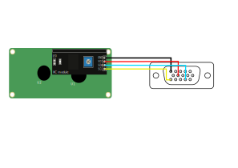

# pcf8574-linux
communicate to a pcf8574 based LCD through i2c on linux machines without any libraries(bit banging).
NOTE: this will only work for MH based i2c backpacks
## Wiring

| VGA Pin | Description |
|---------|-------------|
| 5       | Ground      |
| 9       | +5V DC      |
| 12      | SDA         |
| 15      | SCL         |

## Execution
Ensure you have the `i2c-dev` module,```i2c-tools```and ```python3``` is installed.
Load the i2c-dev module:
```
sudo modprobe i2c-dev
```
then, list all the i2c adapters by this command: 
```
$ sudo i2cdetect -l
i2c-0	smbus     	SMBus I801 adapter at 6040      	SMBus adapter
i2c-1	i2c       	i915 gmbus ssc                  	I2C adapter
i2c-2	i2c       	i915 gmbus vga                  	I2C adapter
i2c-3	i2c       	i915 gmbus panel                	I2C adapter
i2c-4	i2c       	i915 gmbus dpc                  	I2C adapter
i2c-5	i2c       	i915 gmbus dpb                  	I2C adapter
i2c-6	i2c       	i915 gmbus dpd                  	I2C adapter
i2c-7	i2c       	AUX A/DDI A/PHY A               	I2C adapter
i2c-8	i2c       	AUX C/DDI C/PHY C               	I2C adapter
i2c-9	i2c       	AMDGPU i2c bit bus 0x96         	I2C adapter
```
What you're after is the ```DDI``` adapter which in this case could either be ```i2c-7``` or ```i2c-8```. A simple way to check is to first run a scan before plugging the display in.
Scanning ```i2c-8```:
```
$ sudo i2cdetect -y 8
     0  1  2  3  4  5  6  7  8  9  a  b  c  d  e  f
00:                         -- -- -- -- -- -- -- -- 
10: -- -- -- -- -- -- -- -- -- -- -- -- -- -- -- -- 
20: -- -- -- -- -- -- -- -- -- -- -- -- -- -- -- -- 
30: -- -- -- -- -- -- -- -- -- -- -- -- -- -- -- -- 
40: -- -- -- -- -- -- -- -- -- -- -- -- -- -- -- -- 
50: -- -- -- -- -- -- -- -- -- -- -- -- -- -- -- -- 
60: -- -- -- -- -- -- -- -- -- -- -- -- -- -- -- -- 
70: -- -- -- -- -- -- -- --   
```
After plugging the display in:
```
$ sudo i2cdetect -y 8
     0  1  2  3  4  5  6  7  8  9  a  b  c  d  e  f
00:                         -- -- -- -- -- -- -- -- 
10: -- -- -- -- -- -- -- -- -- -- -- -- -- -- -- -- 
20: -- -- -- -- -- -- -- -- -- -- -- -- -- -- -- -- 
30: -- -- -- -- -- -- -- -- -- -- -- -- -- -- 3e 3f 
40: -- -- -- -- -- -- -- -- -- -- -- -- -- -- -- -- 
50: -- -- -- -- -- -- -- -- -- -- -- -- -- -- -- -- 
60: -- -- -- -- -- -- -- -- -- -- -- -- -- -- -- -- 
70: -- -- -- -- -- -- -- --  
```
Notice how two addresses popped up though there can only be one address to interface with, this is usually because the i2c adapter is scanning for 8-bit addresses while the display utilizes a 7-bit address, choose the value which is the greatest. In this case ```3f``` is the chosen value.
**NOTE: Please ensure you have correctly identified both the adapter and the address otherwise writing to the wrong i2c adapter could brick your computer.**

Now run the python script by the following command:
```
sudo python3 ./pcf8574.py [address] [interface]
```
```
sudo python3 ./pcf8574.py 3f 8
```

## Resources
A more thorough explanation by mitxela: https://mitxela.com/projects/ddc-oled
